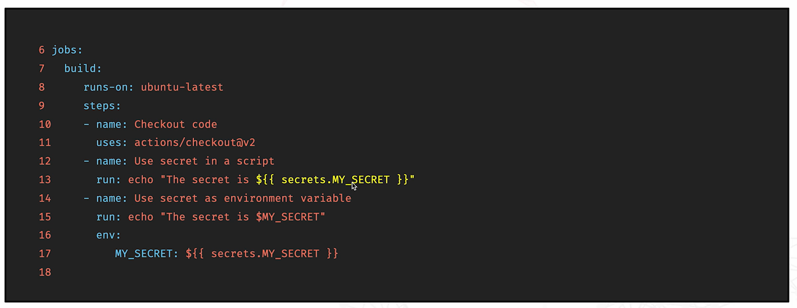

Conditions: Allow you to control when a job or step shoudl run based on certain criteria.

Expressions: Provide a way to perform calculations, manipulate strings, and more within your workflow file.

# Maxtrix builds and parallel testing

Matrix builds allows you to run multiple job configurations in parallel.

This can be useful testing across different environments (e.g., Python versions, operating systems)

# Secrets & Encrypted vars

- Secrets are senitive pieces of information such as API keys, passwords, or any  credentials that you don't want to expose in your codebase.

# Creating custom actions

- Custom actions are reusable units of code that automate specific tasks in your CI/CD pipeline.

# Steps to Create a Custom Action:

- Create a New Repository for your action

- Define the Action Metadata in an action.yml file

- Write the Code for your action

- Publish Your Action to GitHub Marketplace (optional).

# Sharing and reusing actions in different projects

- Benefits of Reusable Actions:

- Consistency

- Efficiency

<h1> Automated testing and lining </h1>

<h2> Linting: </h2>
- Analysing code for potential errors and enforcing coding standards.
- Maintain code quality
- Catch syntax errors

<h2>Automated Testing</h2>
- Running tests automatically on your codebase to ensure it works as expected.
- Detect issues early
- Ensure code quality

<h1> Deploying to various environments (staging, dev, production, etc </h1>

<h2> Environment types </h2>

- Development: this is like a sandbox environment where developers can test new features and bug fixes. This is where experimentation happens.

- Staging: this is an environment that closely mirrors the production environment. This is where you do final testing to catch any issues that may have slipped through in development.
  
- Production: this is the live environment. This is the environment where your users are able to access you application.

  <h2> Deployment Strategies </h2>

- Manual deployment: involves manually moving code from one environment to another. It is straight forward, but prone to 
  human error and can be time-consuming.

- Automated deployment: these deployments use scripts and tools to move code between environments. This is faster, more 
  reliable, and reduces the risk of mistakes.

<h1> Security in CI/CD: Best practices for secure workflows </h1>

- Secure your secrets - never hardcode these into your source code.
- Control Access - control who has access to your repositories and workflows.
- Scan for vulnerabilities - by identifying and addressing vulnerabilities early, you reduce the risk of security breaches and it ensures your code remains secure.
- Audit and Monitor - make sure to monitor and audit your CI/CD pipelines. Keep track of who did what and when by enabling logging and auditing features. Monitor your pipelines for any unusual or suspicious activity. Set up alerts for any potential security incidents.

